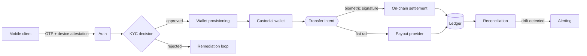

<picture>
  <source media="(prefers-color-scheme: dark)" srcset="https://raw.githubusercontent.com/easywebdev4u/easywebdev4u/main/assets/header-dark.svg">
  <source media="(prefers-color-scheme: light)" srcset="https://raw.githubusercontent.com/easywebdev4u/easywebdev4u/main/assets/header-light.svg">
  
</picture>

**[thealchemyst.dev](https://thealchemyst.dev)** &nbsp;·&nbsp; **[LinkedIn](https://www.linkedin.com/in/ajay-singh-69a083108/)** &nbsp;·&nbsp; **[aksingh1493@gmail.com](mailto:aksingh1493@gmail.com)**

---

I lead engineering on a cross-border payments platform. Seven years across fintech, Web3, and consumer scale — Paytm, a Cosmos-based Web3 product, and now a remittance stack I own end to end: Go microservices, React Native, AWS, and the compliance machinery underneath it.

Most of what I ship is in private repositories. So instead of a wall of green squares, here is how I actually think about systems.

---

## The problem I work on

Moving money across borders looks like one API call and is really a distributed transaction across systems that do not share a clock, a ledger, or an opinion about failure.

**What makes it hard is not the happy path.**

| Failure mode | Why the naive design breaks |
|---|---|
| Provider times out after debit | Client retries, user is charged twice. Needs idempotency keys at the boundary, not in the handler |
| Rate moves mid-transaction | Quote and execution must be separated, with an explicit expiry and a re-quote path |
| Webhook arrives before the API response | Ordering cannot be assumed. State machines must accept events out of order |
| Partial settlement | On-chain succeeded, fiat leg failed. There is no rollback — only compensation |
| Two services, one shared database | Migration keyed on version alone collides silently across services |

The lesson I keep relearning: **in payments, the ledger is the product.** Everything else is a user interface over it.

---

## Selected work

<b>PandaMoney</b> — Tech Lead, 2025 → present &nbsp;·&nbsp; <i>Go, React Native, AWS, Kubernetes</i>

 

Cross-border remittance and wallet platform. Architecture through production ownership.

- Go microservices on EKS, GitOps deployment, per-service Helm releases
- React Native app — biometric-signed transactions, SSL pinning, hardware-backed key storage
- Custodial blockchain wallets across multiple chains, with automated treasury sweeps
- Multi-provider KYC orchestration with per-corridor routing and webhook reconciliation
- Event-driven notification fan-out — push, SMS, email, and websocket from one publisher
- Fraud surface work: device identity, request nonces, velocity limits, SMS-pumping defence

<b>Six Sigma Sports</b> — SDE-3, Web3, 2022 → 2025 &nbsp;·&nbsp; <i>Remix, CosmJS, gRPC</i>

 

Frontend architecture for a Cosmos-based betting platform.

- Halved load times, +40% engagement after an architecture rewrite
- Web3Auth + OAuth2 + Synaps KYC integration → +35% engagement
- DeFi wallet support across Keplr, Leap, and Cosmostation, desktop and mobile
- gRPC blockchain data framework powering two products
- Published an npm package for Cosmos message composing and broadcasting
- Real-time layer over WebSockets with graceful degradation

<b>Paytm</b> — Senior Software Engineer, 2020 → 2022 &nbsp;·&nbsp; <i>React, Node.js</i>

 

Consumer scale, multiple business units.

- **Hotels** — React booking interface, +20% bookings in one quarter
- **ONDC** — interoperability +40%, operational efficiency +25%
- **Mall** — return and exchange flow serving 2M+ customers
- **Seller Panel** — operational issues down 35%, seller satisfaction up 15%
- **Hi5** — group-buying platform, +30% engagement and +50% transactions in four months
- Email template system that cut design-test iterations in half

<b>Earlier</b> — Trakinvest, Good Earth, 2019 → 2020

 

- Trading platform rewrite in React; Gatsby marketing site with SEO; Next.js SSR product
- Automated certificate issuance; dynamic event pages (+20% participation)

---

## Tooling

| | |
|---|---|
| **Languages** | Go · TypeScript · JavaScript · SQL |
| **Frontend** | React · Next.js · React Native · Remix · Tailwind |
| **Backend** | Gin · GORM · REST · gRPC · WebSockets · RabbitMQ |
| **Data** | PostgreSQL · Redis |
| **Cloud** | AWS (EKS, S3, CloudFront, SNS/SQS, Secrets Manager) · Kubernetes · ArgoCD · Docker |
| **Web3** | CosmJS · Web3Auth · wallet integrations · on-chain settlement |
| **Practice** | System design · observability · incident response · GenAI-assisted delivery |

---

## How I work

- **Verify before asserting.** A function that exists is not a function that runs. I check the call site.
- **The dry run before the argument.** Every migration gets rehearsed against real data first.
- **Measured beats inferred.** I say which numbers came from a query and which came from reasoning.
- **A plausible cause is not the cause.** Before blaming the deploy, I look for the counter-example.

---

Open to conversations about payments infrastructure, distributed systems, and hard frontend problems.

